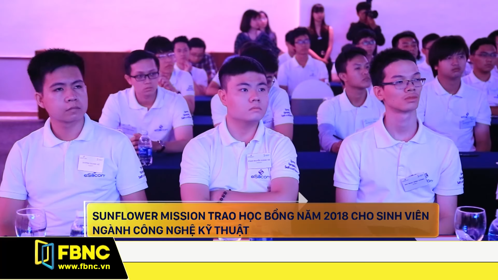

A Vietnamese from Bien Hoa city, Dong Nai, Vietnam.

## Current
- Pursue **Master's degree** in Electrical Engineering at National Formosa University, Taiwan. Expected to graduate in August 2023.
- **Research Assistant** at Digital System Design Lab, National Formosa University.
- **Teaching Assistant** in Embedded Systems & AMD Xilinx FPGA.
- **Leader** of Vietnamese Graduate Student Group at NFU.

## Experience
- **Research Assistant**, [Digital System Design Lab, National Formosa University, Taiwan](http://sparc.nfu.edu.tw/~ccsun/).
  - Jan 2022 - Present
  - Work on several Industry–Academia Collaborative R&D Projects employing Embedded Systems & FPGA-based deep learning; Linux system administrator of Lab's servers; Conduct literature review for research funding proposals; Teaching Assistant; Technical Trainer of FPGA-based ML/AI Application Design Contest for Students; Contribute to several open-source FPGA repositories of AMD Xilinx.
- **Platform Validation Engineer**, [Ampere Computing, Vietnam](https://amperecomputing.com/en/).
  - Mar 2021 - Oct 2021 · 8 mos
  - Work on **System Level Testing Framework** to screen CPU; Collaborate with International Stakeholders.
- **Software Engineer**, [Ban Vien Company, Vietnam](https://banvien.com/).
  - Sep 2019 - Feb 2021 · 1 yr 6 mos
  - Work on **Automotive System-on-Chips Modeling for Automated Driving** project.
- **Intern**, [Renesas Design Vietnam Co., Ltd, Vietnam](https://vietnam.renesas.com/).
  - Feb 2019 - May 2019 · 4 mos
  - Work on Acceptance Testing for AUTOSAR MCAL.

## Education
- [National Formosa University (NFU)](https://www.nfu.edu.tw/)
  - [Master's degree, Electrical Engineering, 2021 - 2023.](https://github.com/haipnh/NFU-EE-Master)
  - Activities: Research Assistant & TA at [Digital System Design Lab](http://sparc.nfu.edu.tw/~ccsun/); Leader of Vietnamese Graduate Student Group at NFU.
- [Ho Chi Minh City University of Technology and Education (HCMUTE)](https://en.hcmute.edu.vn/)
  - Bachelor's degree, Computer Engineering (High Quality Training), 2015 - 2019.
  - Activities: Embedded Systems & Real-time Operating Systems Teaching Assistant; Student Counselor of Faculty of High Quality Training.

## Licenses & certifications
- [Algorithmic Toolbox, University of California San Diego & Coursera](https://www.coursera.org/account/accomplishments/verify/PTXGC8TYT3TT)
- [MATLAB Programming Techniques, MathWorks](https://matlabacademy.mathworks.com/progress/share/certificate.html?id=1386a2d3-c5a2-4c38-9ebe-bdc46a7d9c50)
- [Image Processing with MATLAB, MathWorks](https://matlabacademy.mathworks.com/progress/share/certificate.html?id=2027ede6-9351-4c6b-af5b-f0f869462118)
- [Introduction to Linear Algebra with MATLAB, MathWorks](https://matlabacademy.mathworks.com/progress/share/certificate.html?id=06fed09a-0d57-4c86-a33e-ca0b886ac644)
- [Introduction to Statistical Methods with MATLAB, MathWorks](https://matlabacademy.mathworks.com/progress/share/certificate.html?id=bbbaf7f3-8372-41ac-9181-8d0809a7b90d)
- [Introduction to Symbolic Math with MATLAB, MathWorks](https://matlabacademy.mathworks.com/progress/share/certificate.html?id=e0c84c73-8fa8-4dde-8c21-a51a5e961a4e)

## Awards
- Winner of 2018 Sunflower Mission Engineering and Technology Scholarship Awards

- Several Semester scholarships for individuals with excellent academic results, by Faculty for High Quality Training, HCMUTE.

## Personality
- a Catholic.
- Hobbies: movies; music; trekking; work-out; reading; photos; arts; sight-seeing.

## Contacts
- [LinkedIn](https://www.linkedin.com/in/haipnh/)
